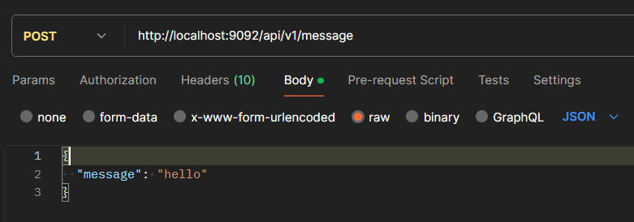

# Kafkatest
An application testing Kafka's data processing capabilities.

## Table of Contents
* [General Info](#general-information)
* [Technologies Used](#technologies-used)
* [Features](#features)
* [Screenshots](#screenshots)
* [Setup](#setup)
* [Usage](#usage)
* [Project Status](#project-status)
* [Room for Improvement](#room-for-improvement)

## General Information
An application created to test Kafka's data processing capabilities with Zipkin gathering timing data needed to troubleshoot latency problems.

## Technologies Used
Java, Docker, Kafka, OpenAPI, Zipkin.

## Features
Publishing messages.

## Screenshots

## Setup
Open two terminals. First, go to the correct location: `cd kafka_location/bin/windows`
Then in each one of them start: `zookeeper-server-start.bat ../../config/zookeeper.properties` and `kafka-server-start.bat ../../config/server.properties`.

Docker version:
Start Docker Desktop.
Use the command `docker-compose up -d`.
Verify if servers are listening: `netstat -ano | findStr "22181"`, `netstat -ano | findStr "29092"`, `netstat -ano | findStr "32181"`, `netstat -ano | findStr "39092"`, `netstat -ano | findStr "9092"`

## Usage
Use request or use OpenAPI to send message POST http://localhost:9092/api/v1/messages.
Check latency at `http://localhost:9411/zipkin/` (button "RUN QUERY"). 

## Project Status
In progress.

## Room for Improvement
More functionalities.

